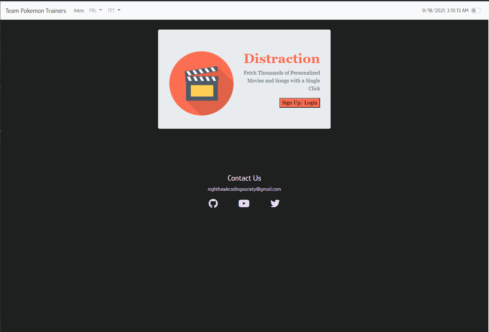
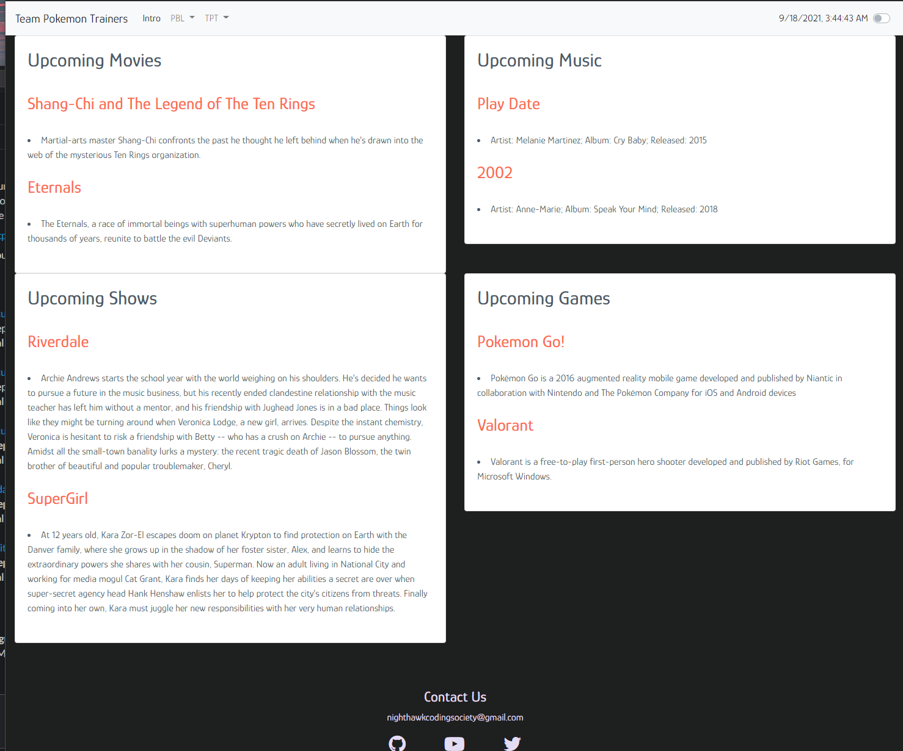
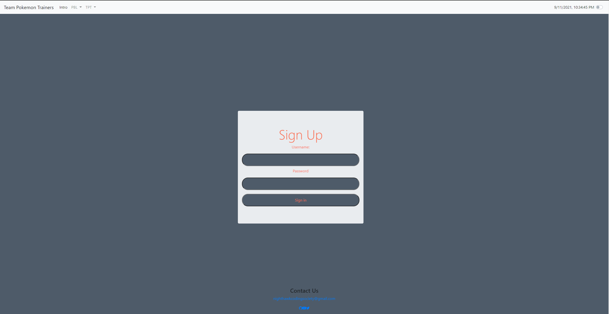
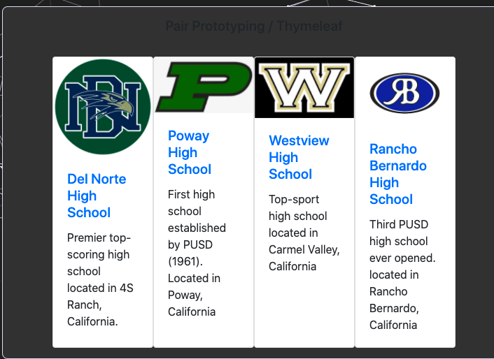
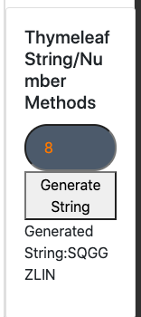
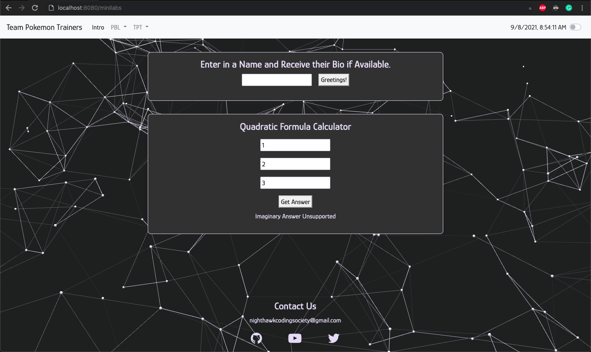
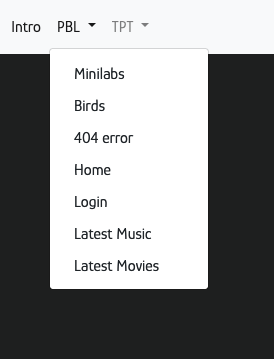
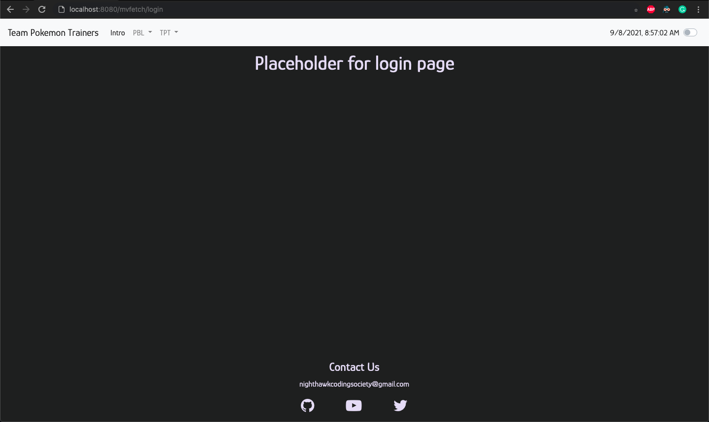

# Team Pokemon Trainers - README.md

- [Runtime Link (Running Project)](https://csa-t1.herokuapp.com/)
- [Team Scrum Board](https://github.com/alvinzhengq/AP-CSA-T1/projects/2)
- [All Team Commits](https://github.com/alvinzhengq/AP-CSA-T1/commits/master)
- [Team Insight Graphs](https://github.com/alvinzhengq/AP-CSA-T1/graphs/contributors)

## Team Members:
| Team Member | Github Username | Github Profile | Journal Link | Github Contributions | Issues | Scrum Board Tasks | 
| ----------- | --------------- | -------------- | ------------ | -------------------- | ------ | ----------------- |
| Akshay R. | Akshay-Rohatgi | [Akshay's Profile](https://github.com/Akshay-Rohatgi) | [Akshay's Journal](https://docs.google.com/document/d/1ukhc3TYFyQycQntN6MXiD803b-iatn8rK7GAcw4ClwI/edit?usp=sharing) | [Akshay's Contributions](https://github.com/alvinzhengq/AP-CSA-T1/commits?author=Akshay-Rohatgi) | [Issues](https://github.com/alvinzhengq/AP-CSA-T1/issues/assigned/Akshay-Rohatgi) | [Scrum Board Tasks](https://github.com/alvinzhengq/AP-CSA/projects/1?card_filter_query=assignee%3Aakshay-rohatgi) | 
| Alvin Z. | alvinzhengq | [Alvin's Profile](https://github.com/alvinzhengq) | [Alvin's Journal](https://docs.google.com/document/d/1FoO8QKsZUOCzHh7b27waq3N_TLW-fYjU-do8X5dhx_c/edit?usp=sharing) | [Alvin's Contributions](https://github.com/alvinzhengq/AP-CSA-T1/commits?author=alvinzhengq) | [Issues](https://github.com/alvinzhengq/AP-CSA-T1/issues/assigned/alvinzhengq) | [Scrum Board Tasks](https://github.com/alvinzhengq/AP-CSA/projects/1?card_filter_query=assignee%3Aalvinzhengq) |
| Nolan P. | nolanplatt | [Nolan's Profile](https://github.com/nolanplatt) | [Nolan's Journal](https://docs.google.com/document/d/1Y6ZQuGgpZF3kwam8YsPOEtXlX7DfSDX-jLqJXDqh1u0/edit?usp=sharing) | [Nolan's Contributions](https://github.com/alvinzhengq/AP-CSA-T1/commits?author=nolanplatt) |  [Issues](https://github.com/alvinzhengq/AP-CSA-T1/issues/assigned/nolanplatt) | [Scrum Board Tasks](https://github.com/alvinzhengq/AP-CSA/projects/1?card_filter_query=assignee%3Anolanplatt) |
| Sami D. | SamiDeshatty | [Sami's Profile](https://github.com/SamiDeshatty) | [Sami's Journal](https://padlet.com/samantadanvers/fje6b94iwjnjwg7y1630177436) | [Sami's Contributions](https://github.com/alvinzhengq/AP-CSA-T1/commits?author=SamiDeshatty) | [Issues](https://github.com/alvinzhengq/AP-CSA-T1/issues/assigned/SamiDeshatty) | [Scrum Board Tasks](https://github.com/alvinzhengq/AP-CSA/projects/1?card_filter_query=assignee%3Asamideshatty) |
| Prisha M. | PrishaMaiti | [Prisha's Profile](https://github.com/PrishaMaiti) | [Prisha's Journal](https://padlet.com/prishamaiti/v5cwhihorrhhgnp5) | [Prisha's Contributions](https://github.com/alvinzhengq/AP-CSA-T1/commits?author=PrishaMaiti) | [Issues](https://github.com/alvinzhengq/AP-CSA-T1/issues/assigned/PrishaMaiti) | [Scrum Board Tasks](https://github.com/alvinzhengq/AP-CSA/projects/1?card_filter_query=assignee%3Aprishamaiti) |

## Project Idea: Distraction
We decided to make a full-stack application showing the latest upcoming music and movies. Users can select a variety of different preferences for genres and they can find the songs and movies that match those preferences; that way, they can find the movies and songs that are best suited for their own interests in a short amount of time. Our app will use APIs such as IMDB, Spotify, and Apple Music to fetch the latest upcoming movies and songs.

**Design Document**: [Link](https://docs.google.com/document/d/1t3b-dTNCqT75uGsQIaGnzfyZC241PK1lPWHXTy1kiRI/edit?usp=sharing)  
 Note: All applicable designs (such as Wireframe screenshots and links) are available in the document above.

**Runtime Link**: TBD

## Team Minilabs
All minilabs completed by team located [here](https://github.com/alvinzhengq/AP-CSA-T1/tree/master/src/main/java/com/example/sping_portfolio/minilabs).
## Scrum Board:
The Scrum board with all tasks and issues is located [here](https://github.com/alvinzhengq/AP-CSA-T1/projects/1).

## Week 8 Updates
In week eight we completed features for our N@TM Project. We also completed the ASCII Minilab
### Project Updates
[Project Presentation](https://docs.google.com/presentation/d/1kWHEpBN9ECS83AXJ4RdohwvjDW8IjF2hh27yYia99CI/edit?usp=sharing)
 
[Successfully deployed project (updated everytime someone commits on Github)](https://csa-t1.herokuapp.com/)

### ASCII Lab (Akshay and Alvin pair)
[ASCII Controller with Methods](https://github.com/alvinzhengq/AP-CSA-T1/blob/master/src/main/java/com/example/sping_portfolio/controllers/ASCII.java)
 
[ASCII HTML View](https://github.com/alvinzhengq/AP-CSA-T1/blob/master/src/main/resources/templates/ascii.html)

### Week 8 Individual Technicals (Timebox)
| Team Member | Github Username | Technical Task | Contribution Links |
| ----------- | --------------- | -------------- | ------------------ | 
| Akshay R. | Akshay-Rohatgi | Backend: Genre Select, ASCII Minilab   Frontend: Genre Selection HTML View, ASCII Minilab View  | [Genre Select + Genre Selection HTML View](https://github.com/alvinzhengq/AP-CSA-T1/commit/ed3a8bf7eacc6e472595d1c7fd46ee520b61281f), [ASCII Minilab + HTML View](https://github.com/alvinzhengq/AP-CSA-T1/commit/d7ecb042d506bedd629a6845de013757a1b02231) |
| Alvin Z. | alvinzhengq | Backend: Music Backend, ASCII Backend   Frontend: Music Frontend| [Music Frontend + Backend](https://github.com/alvinzhengq/AP-CSA-T1/commit/0c5663bc6cd8ad91a5dd34c171524677276f944f), [ASCII Backend](https://github.com/alvinzhengq/AP-CSA-T1/commit/135bebe94989d685080eac615f63146c80510309) |
| Nolan P. | nolanplatt | Backend: Deployment on Heroku | [Deployment](https://github.com/alvinzhengq/AP-CSA-T1/commit/213c5d8b986a43853c9423b73ee50fbeccd0852b) |
| Sami D. | SamiDeshatty | Frontend:  |  |
| Prisha M. | PrishaMaiti | Frontend: Distraction Music Page HTML | [Frontend](https://github.com/alvinzhengq/AP-CSA-T1/commit/e9402b2a85e2e280a1d4c7d69cb38361a00e05b2) |

## Week 7 Updates
In week seven, we were tasked as a team to create the RGB minilab. We all contributed in different ways. See modeling checkpoint and timebox below.
### Project Updates

## Modeling Checkpoint 
[Video detailing lab components](https://drive.google.com/file/d/1FLMJnccPXYb98PAh6K-nwliK4-4gZFJ_/view?usp=sharing)
 
[RGBLab.java](https://github.com/alvinzhengq/AP-CSA-T1/blob/master/src/main/java/com/example/sping_portfolio/controllers/RGBLab.java)
 
[RGBLab Controller](https://github.com/alvinzhengq/AP-CSA-T1/blob/master/src/main/java/com/example/sping_portfolio/controllers/RGB_Controller.java)
 
[RGBLab HTML View](https://github.com/alvinzhengq/AP-CSA-T1/blob/master/src/main/resources/templates/RGB_Lab.html)

### Week 7 Individual Technicals (Timebox)
| Team Member | Github Username | Technical Task | Contribution Links |
| ----------- | --------------- | -------------- | ------------------ | 
| Akshay R. | Akshay-Rohatgi | Backend: ImageProperty | [Commit 1](https://github.com/alvinzhengq/AP-CSA-T1/commit/148f00536c908dff38849c9fea5cde9fcb5ee6e6), [Commit 2](https://github.com/alvinzhengq/AP-CSA-T1/commit/7f38e0e978423d4caec21679469af556ab2fa5ec) |
| Alvin Z. | alvinzhengq | Backend: ImagePropertyRGB | [Commit 1](https://github.com/alvinzhengq/AP-CSA-T1/commit/1027d4c89718c28a297c555fdbf2fdd2b6292bcb), [Commit 2](https://github.com/alvinzhengq/AP-CSA-T1/commit/5cf7b0d167d610f9de173a7e09ae76646c8d37b3) |
| Nolan P. | nolanplatt | Backend: ImageInfo |[Commit 1](https://github.com/alvinzhengq/AP-CSA-T1/commit/a7b447a73e49f606440204312c971116f44a46be), [Commit 2](https://github.com/alvinzhengq/AP-CSA-T1/commit/e659e84da8e6d5c4112f110c738f8577ea3d2c0b) |
| Sami D. | SamiDeshatty | Frontend: HTML Homepage | [Commit 1](https://github.com/alvinzhengq/AP-CSA-T1/commit/2db4a1c4dcec728ed7413d621c4cbec3bb3b6d24), [Commit 2](https://github.com/alvinzhengq/AP-CSA-T1/commit/5b8d4d54c82f3f8ef6114ed410c9423e3fbcf8a9) |
| Prisha M. | PrishaMaiti | Frontend: HTML Homepage | [Commit](https://github.com/alvinzhengq/AP-CSA-T1/commit/1b3382163837a369ca56f73739903c74244fbb9f) |

## Week 6 Updates
In week six, we each created an algorithm and implemented it four different ways. 
### Week 6 Individual Technicals (Timebox)
| Team Member | Github Username | Technical Task | Contribution Links |
| ----------- | --------------- | -------------- | ------------------ | 
| Akshay R. | Akshay-Rohatgi | Geometric Series | [Algorithm Extend Lab](https://github.com/alvinzhengq/AP-CSA-T1/commit/61fa6523beb2d662c031f1de091b62b9699ad5b8)|
| Alvin Z. | alvinzhengq | OEIS A034175 | [Algorithm Extend Lab](https://github.com/alvinzhengq/AP-CSA-T1/commit/7917d020ff79af38e70b7a64819479e4ad898d3e) |
| Nolan P. | nolanplatt | Lucas Numbers |[Algorithm Extend Lab](https://github.com/alvinzhengq/AP-CSA-T1/commit/6b2ebd84fc217d90dd71a55de751c081e8de3954) |
| Sami D. | SamiDeshatty | Pascal's Triangle | [Algorithm Extend Lab](https://github.com/alvinzhengq/AP-CSA-T1/commit/882839f74f2f4fd8817d6a3c17f9881bc82641c0) |
| Prisha M. | PrishaMaiti |  |

## Week 5 Updates

Week 5 was a journal review. We shifted from RGB lab to a journal review at end of week. Mr. Mortensen decided to postpone the RGB lab as it was deemed too difficiult. Hence, our group took the time ot polish our journals. See below.
### Week 5 Individual Technicals (Timebox)
| Team Member | Github Username | Journal |
| ----------- | --------------- | -------------- |
| Akshay R. | Akshay-Rohatgi | [Journal](https://docs.google.com/document/d/1ukhc3TYFyQycQntN6MXiD803b-iatn8rK7GAcw4ClwI/edit?usp=sharing) |
| Alvin Z. | alvinzhengq | [Journal](https://docs.google.com/document/d/1FoO8QKsZUOCzHh7b27waq3N_TLW-fYjU-do8X5dhx_c/edit?usp=sharing) |
| Nolan P. | nolanplatt | [Journal](https://docs.google.com/document/d/1Y6ZQuGgpZF3kwam8YsPOEtXlX7DfSDX-jLqJXDqh1u0/edit?usp=sharing) |
| Sami D. | SamiDeshatty | [Journal](https://padlet.com/samantadanvers/fje6b94iwjnjwg7y1630177436) |
| Prisha M. | PrishaMaiti | [Journal](https://padlet.com/prishamaiti/v5cwhihorrhhgnp5) |

## Week 4 Updates

##### 2 More HTML templates completed:
commits:
- [1](https://github.com/alvinzhengq/AP-CSA-T1/commit/213c5d8b986a43853c9423b73ee50fbeccd0852b)
- [2](https://github.com/alvinzhengq/AP-CSA-T1/commit/ff97a32cfd70be894d112b827c5fcf04ab0f2355)
- [3](https://github.com/alvinzhengq/AP-CSA-T1/commit/94466db24c2b08baf310fdf3602ee217699a2fbd)
- [4](https://github.com/alvinzhengq/AP-CSA-T1/commit/94466db24c2b08baf310fdf3602ee217699a2fbd)
- [5](https://github.com/alvinzhengq/AP-CSA-T1/commit/9b6781cad6fb79702834f5faff1326d88370c088)

Completed Task on Scrum Board: https://github.com/alvinzhengq/AP-CSA-T1/projects/1#card-68379017

### Week 4 Individual Technicals (Timebox)
| Team Member | Github Username | Technical Task | Contribution Links |
| ----------- | --------------- | -------------- | ------------------ | 
| Akshay R. | Akshay-Rohatgi | Hack 1 for Binary Math  + HTML Prototyping | [Hack 1 Commit 1](https://github.com/alvinzhengq/AP-CSA-T1/commit/63d0ae589bcc7824a2d3de759282814665454588), [Hack 1 Commit 2](https://github.com/alvinzhengq/AP-CSA-T1/commit/073bf156982aaf9a6a5ec2e92a9d4b03ed15fc5e), [HTML Prototyping](https://github.com/alvinzhengq/AP-CSA/commit/9b6781cad6fb79702834f5faff1326d88370c088) |
| Alvin Z. | alvinzhengq | HTML Prototyping | [CSS Fix](https://github.com/alvinzhengq/AP-CSA-T1/commit/8aedee5b42fccbb2e742fbab37e2ecfb27606863), [Hack 2, 3, 4](https://github.com/alvinzhengq/AP-CSA-T1/commit/7b11212cb573a37aae2281f1c0ebb64258ac13ba) |
| Nolan P. | nolanplatt | Hack 2 for Binary Math |[Hack 2 Commit](https://github.com/alvinzhengq/AP-CSA-T1/commit/a984d425de80878829f4a7719ca91560c8bae5ce) |
| Sami D. | SamiDeshatty | HTML Prototyping | [Home Page](https://github.com/alvinzhengq/AP-CSA-T1/commit/3ed9194416c00929ac5ad11eba5e7455b5bdd7dc), [Movies Page](https://github.com/alvinzhengq/AP-CSA-T1/commit/94466db24c2b08baf310fdf3602ee217699a2fbd), [Webpage Organization](https://github.com/alvinzhengq/AP-CSA/commit/14be82862deea4e0c2f1d4e4c4d8f0e6f840d301) |
| Prisha M. | PrishaMaiti |  |

## Week 3 Updates

We started working on the login page for our project idea:
 
[Link to commit](https://github.com/alvinzhengq/AP-CSA-T1/commit/774576c87d2f15c76f8395c6d5149b3c7054bb5f)

We created a minilab with 3x3 Bootstrap Cards. This shows 9(3x3) different logos, names, and short descriptions of some PUSD schools:
 
[Link to commit](https://github.com/alvinzhengq/AP-CSA-T1/commit/fc8625f6b170bddaa52cbb1525f3bf5c34913542)
 

We created a minilab that generates a string given the length of the string by the user. Includes frontend, backend, and API development.
 
[Link to commit](https://github.com/alvinzhengq/AP-CSA-T1/commit/effa0427a0faf984ebb7a9b81a4d978f6ad6870e)
 

## Week 2 Updates

Our new mini labs page with the Greeting/Bird integration, and Math lab.

An example of the new placeholder pages we added to the navbar:  

Here's what one of the placeholder pages looks like:

